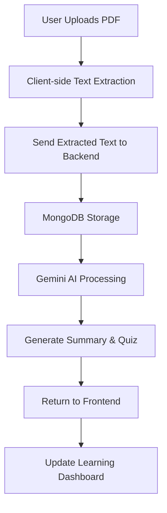

# Personalized Content Learning Platform - Frontend

A React-based frontend application for personalized content learning that provides an engaging, interactive learning experience with AI-powered content analysis and quiz generation.

## 🚀 Features

- **Interactive Dashboard**: View all uploaded content with progress tracking
- **PDF Upload & Processing**: Client-side PDF text extraction (no files sent to backend)
- **AI-Powered Learning**: Summaries and quizzes generated using Gemini 1.5-Flash
- **Adaptive Learning**: Performance-based learning paths (Weak, Moderate, Strong)
- **Real-time Progress Tracking**: Visual progress indicators and achievement system
- **Responsive Design**: Modern UI with Tailwind CSS and Framer Motion animations

## 🛠️ Technology Stack

- **Framework**: React 19 with Vite
- **Styling**: Tailwind CSS v3
- **Animations**: Framer Motion
- **Routing**: React Router DOM
- **State Management**: React Context API
- **PDF Processing**: PDF.js (client-side text extraction)
- **Icons**: Heroicons & Lucide React
- **Charts**: Recharts & React Circular Progressbar

## 📁 Project Structure

```
src/
├── components/
│   └── layout/
│       └── Navbar.jsx          # Navigation component
├── contexts/
│   ├── AuthContext.jsx         # Authentication state management
│   └── LearningContext.jsx     # Learning content state management
├── pages/
│   ├── Dashboard.jsx           # Main dashboard with content overview
│   ├── UploadContent.jsx       # PDF upload and processing
│   ├── Learning.jsx            # Content reading and learning
│   ├── Quiz.jsx               # Interactive quiz component
│   └── Summary.jsx            # Content summary view
├── utils/
│   ├── pdfProcessor.js        # Client-side PDF text extraction
│   └── api.js                 # API communication with backend
├── App.jsx                    # Main application component
├── main.jsx                   # Application entry point
└── index.css                  # Global styles and Tailwind configuration
```

## 🔄 Current Status & Data Flow

### Current Implementation
- ✅ **Frontend**: Fully functional with dummy data
- ✅ **UI/UX**: Complete interactive learning interface
- ✅ **PDF Processing**: Client-side text extraction implemented
- 🔄 **Backend Integration**: In progress (uses mock data currently)

### Data Flow Architecture



### PDF Processing Workflow
1. **File Upload**: User drags/drops PDF files in the upload interface
2. **Client Processing**: PDF text is extracted using PDF.js on the frontend
3. **Text Transmission**: Only extracted text (not the PDF file) is sent to backend
4. **AI Processing**: Backend uses Gemini 1.5-Flash for content analysis
5. **Storage**: Text content and metadata stored in MongoDB
6. **Learning Path**: AI determines difficulty and creates personalized learning content

## 🔐 Authentication & Database

### Clerk Integration
- **Authentication**: Clerk handles user login/signup with multiple providers
- **Database**: MongoDB stores all application data with Mongoose ODM
- **No File Storage**: PDF files are processed client-side; only text is stored

### Data Models

#### User Model
```javascript
{
  clerkUserId: "clerk_user_id",
  email: "user@example.com",
  displayName: "John Doe",
  photoURL: "profile_image_url",
  createdAt: "timestamp",
  learningStreak: 7,
  totalContent: 5,
  completedContent: 2
}
```

#### Content Model
```javascript
{
  id: "unique_content_id",
  userId: "clerk_user_id",
  title: "PDF Document Title",
  extractedText: "Full extracted text content...",
  summary: "AI-generated summary",
  difficulty: "beginner|intermediate|advanced",
  estimatedTime: "5 minutes",
  progress: 65,
  status: "uploaded|in-progress|completed",
  createdAt: "timestamp",
  updatedAt: "timestamp"
}
```

#### Quiz Model
```javascript
{
  contentId: "content_reference_id",
  questions: [
    {
      id: 1,
      question: "What is the main topic?",
      options: ["A", "B", "C", "D"],
      correct: 0,
      explanation: "Explanation text",
      difficulty: "easy|medium|hard"
    }
  ],
  generatedAt: "timestamp"
}
```

## 🚀 Getting Started

### Prerequisites
- Node.js 18+ 
- npm or yarn
- Clerk application (for authentication)
- MongoDB database (for backend integration)

### Installation

1. **Clone the repository**
   ```bash
   git clone <repository-url>
   cd frontend
   ```

2. **Install dependencies**
   ```bash
   npm install
   ```

3. **Environment Configuration**
   Create a `.env` file:
   ```env
   VITE_API_URL=http://localhost:5001
   VITE_CLERK_PUBLISHABLE_KEY=your_clerk_publishable_key
   ```

4. **Start development server**
   ```bash
   npm run dev
   ```

5. **Open application**
   Navigate to `http://localhost:3000`

## 🔧 Available Scripts

- `npm run dev` - Start development server
- `npm run build` - Build for production
- `npm run preview` - Preview production build
- `npm run lint` - Run ESLint

## 🎯 Learning Flow

### 1. Content Upload
- Drag & drop PDF files
- Client-side text extraction
- Progress indication during processing
- Automatic AI analysis and categorization

### 2. Learning Process
- **Reading Phase**: Interactive content display with progress tracking
- **Quiz Phase**: AI-generated questions based on content
- **Performance Analysis**: Real-time scoring with behavioral factors

### 3. Adaptive Learning Paths
- **Strong Performers**: Advanced challenges and level-up quizzes
- **Moderate Performers**: Targeted practice in weak areas
- **Weak Performers**: Interactive, gamified learning with animations

### 4. Progress Tracking
- Visual progress indicators
- Learning streaks and achievements
- Performance analytics and insights

## 📝 API Integration

The frontend communicates with the backend through RESTful APIs:

### Endpoints
- `POST /api/auth/login` - User authentication
- `POST /api/content/upload` - Upload extracted text
- `GET /api/content` - Retrieve user content
- `GET /api/content/:id/summary` - Get content summary
- `GET /api/content/:id/quiz` - Get quiz questions
- `POST /api/quiz/submit` - Submit quiz answers
- `PUT /api/content/:id/progress` - Update learning progress

## 🚀 Getting Started

### Prerequisites
- Node.js 18+ 
- npm or yarn
- Firebase project (for backend integration)

### Installation

1. **Clone the repository**
   ```bash
   git clone <repository-url>
   cd frontend
   ```

2. **Install dependencies**
   ```bash
   npm install
   ```

3. **Start development server**
   ```bash
   npm run dev
   ```

4. **Open application**
   Navigate to `http://localhost:3000`

## 🔧 Available Scripts

- `npm run dev` - Start development server
- `npm run build` - Build for production
- `npm run preview` - Preview production build
- `npm run lint` - Run ESLint

If you are developing a production application, we recommend using TypeScript with type-aware lint rules enabled. Check out the [TS template](https://github.com/vitejs/vite/tree/main/packages/create-vite/template-react-ts) for information on how to integrate TypeScript and [`typescript-eslint`](https://typescript-eslint.io) in your project.
